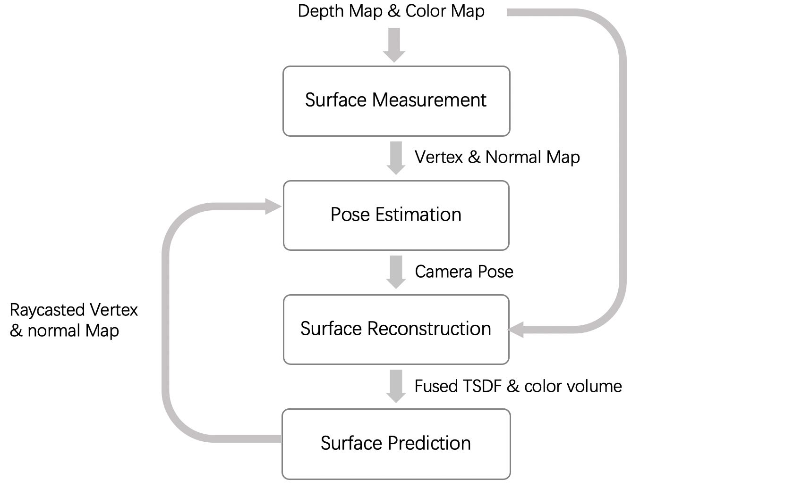

# Introduction

Kinect Fusion is a technology that allows for the reconstruction of 3D models of real-world objects and scenes using depth data from a Kinect sensor. The original version of Kinect Fusion has been widely used in various applications, including 3D printing and virtual and augmented reality. However, with advancements in computational techniques and algorithms, it is possible to improve upon the original implementation to create a more accurate and efficient version of the technology. This project aims to re-implement multiple versions of Kinect Fusion through different methods and explore the impact of different implementations on performance.  As a re-implementation work, we will still implement the various modules according to the original version of Kinect Fusion.

# Workflow



# Requirement

**Packages requirement:**

FreeImage  
Eigen  
OpenCV  
CUDA  


**Structure requirement:**
 `
1. Data folder
	
	Create a ```Data/``` folder on the top level and add the data file inside.
	We use TUM RGB-D Dataset [links](https://vision.in.tum.de/data/datasets/rgbd-dataset), please set the dataset on proper location
	e.g Data/rgbd_dataset_freiburg1_xyz/..

2. Build directory 
    
	Create the ```build/``` folder and in this case, we can create an out-of-source build.
    
3. Libs folder

 	Create a ```Libs/``` folder to store packages.

4. results folder

 	Create a ```results/``` folder to store generated result.
    
# Run the project

After all the packages are prepared and structure requirements are met, we run the project:

```bash
cd build/
cmake ..
make 
./KinectFusion
```

We provide a series of output to help you track the operation of the program.  
So you can see how long KinectFusion takes at each step.  
At the end of the execution, the program generates the complete reconstruction result `sum_out_mesh.off`

